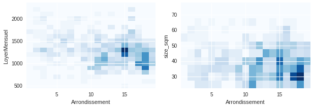
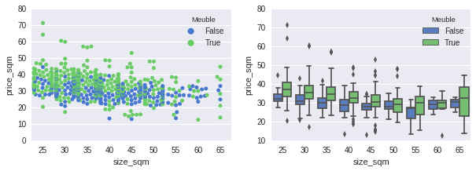
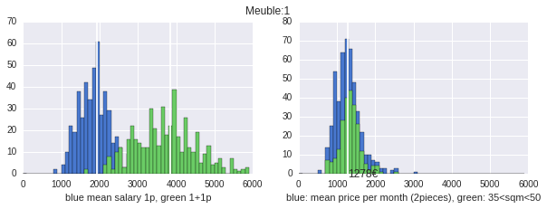

# Machine Learning Paris Flats

I just moved to Paris from Germany, and I find the flats-renting market quite different and more complicate.
That's not only because of the prices. Thus, in this series of notebooks I want to get a quantitative view of the situation.

The idea is to scrap some data from websites to measure  the obvious:  eg. price _vs_ district; and the less obvious: e.g. a non-linear size _vs_ price/sqm relation, or lack of relations with respect to cases in which one would expect a correlation.

**TL;DR:** 

[the notebook on *nbviewer*](https://nbviewer.jupyter.org/github/astyonax/machine-learning-paris-flat/blob/master/v2/LBC-simple.ipynb)

[the *jupyter notebook* as web-page](http://htmlpreview.github.io/?https://github.com/astyonax/machine-learning-paris-flat/blob/master/v2/rendered/LBC-simple.html).

## Summary of analysis

The following data is for  fournished, 2 rooms flats, with minumu size of 30m2, within Paris only.

### Flats distribution per arrondissement and per size

 
*Figure 1:  Histogram of 2 rooms flats per price and per arrondissement (left) and per binned size and per arrondissement (right). Size binning = 5m2. Minimum size capped at 30m2.*

### Price distributions

*Figure 2:  Two visualizations of the price per square meter (€/m2) versus flat sizes, averaged over arrondissement. Blue: unfournished, Green: fournished. **Note**: The price per square meter obviously decreases with flat size, however the noise appears to be quite important, probably meaning that we are missing some important variables.*

*Figure 3: Visualization of the price per square meter versus arrondissement, flat size. Red dots: unfournished. Filled dots: fournished.*

*Figure 4: Energy efficiency of Paris flats. There is no need to comment.*

### Relevant features

I didn't try to get all possible informations from the records, and I already see that, altought the prices seem quite *noisy*, I picked up features that are (linearly) irrelevant in pricing a flat. Since the price-generating system is quite well trained, I think that it should be possible to get a quasi-deterministic description of the prices.. once all the relevant features (or d.o.f) are identified.

Indeed, the plot below shows that whether a flat is furnished and its energy efficiency does not really correlate with any of the other features (say, the price or the size). This result has to be taken with some salt, as the feature *fournished* does correlate (see Fig. 3). But probably the signal is, in average, well below noise level, or it has a non-linear relation with the other features.

*Figure 6: PCA to identify some important features. There is no attempt to do a more robust assesment with a kernel PCA (I don't need it now). Note, however, that the 3 modes shown represent about 97% of the data, so they are enough (in this case)*

### Sustainability

How much does a couple has to earn to afford to live in Paris? 
Using the rule that a flat can't be more expensive than 1/3 of the net total income of the inhabitants, the average needed income per person per month is show in left panel (blue histogram), assuming that the flat is inhabited by 2 persons with equal income.

*Figure 7: (Right) Price distribution of all flats of 2 rooms (blue), of flats with size  between 35m2 and 50m2 -- (Left) The average income for a couple (Green), and of per person (assuming 2 persons in the flat, and equal income). White lines correspond to the average of the distribution.*

---
**To be continued...**

--- 
## [V 2 -- the newest](v2/)

**TL;DR:** [the *jupyter notebook* as web-page](http://htmlpreview.github.io/?https://github.com/astyonax/machine-learning-paris-flat/blob/master/v2/rendered/LBC-simple.html).

[The second (and current)](v2/) version is more straightforward than the 1st one thanks to the use of a better data source ([Le Bon Coin](leboncoin.fr)).

The flats price versus flats features are quite self-explaining by the plots. A heatmap of *price per arrondissement* is done with the [Leaflet ipython extension](https://github.com/ellisonbg/ipyleaflet).

## [V 1](v1/)
In [the first version](v1/) I took the data from a complicate website, thus we use some creative way to fill in the empty or wrong records.s

## Dependencies

* `Jupyter`
* `Beautifulsoup`
* `Pandas` 
* `Scikit-learn`
* fuzzy string matching
* `Seaborn`
